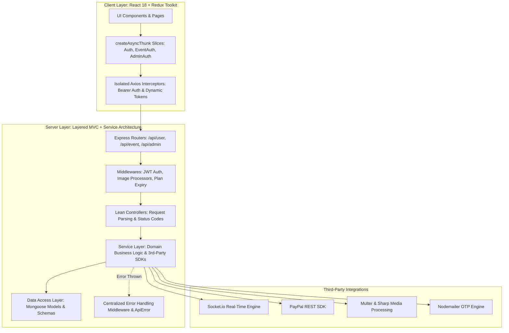

# EventSphere 🌐

> A modern, scalable, full-stack event management and social networking platform built with **Node.js, Express, MongoDB, React 18, and modern Redux Toolkit (RTK)**.

---

## 🚀 Overview

**EventSphere** bridges the gap between event organizers, attendees, and job seekers in the event industry. It supports real-time communication, media sharing, hiring management, and subscription monetization across three distinct user roles:

1. **Attendees / Users**: Discover events, engage with feeds (like, comment, threaded replies), follow organizers, view disappearing stories, apply for industry jobs, real-time 1-on-1 chat, and 1-on-1 video calling.
2. **Event Organizers**: Publish event updates and stories, recruit personnel with targeted job postings, manage applicants, subscribe to premium visibility plans via PayPal, and connect with attendees via chat/video.
3. **Administrators**: Comprehensive back-office dashboard with platform analytics, revenue tracking, user/event moderation, subscription plan management, and banner ad curation.

---

## 🏗️ Architecture & Engineering Standards

The codebase has been refactored into an enterprise-grade **Service-Oriented MVC Architecture** on the backend and modern **Redux Toolkit (RTK)** architecture on the frontend:



### Key Engineering Highlights

- **Service-Oriented Architecture (SOA)**: Extracted all business logic, database queries, and third-party API orchestration out of monolithic controllers into dedicated, testable domain services (`AuthService`, `UserService`, `EventService`, `JobService`, `CommentService`, `ChatService`, `PaymentService`, `AdminService`).
- **Centralized Error Framework**: Implemented custom `ApiError` extending native `Error` paired with Express error handling middleware that captures Mongoose validation, CastErrors, duplicate keys, and JWT expirations into standardized REST JSON responses.
- **Isolated HTTP Network Interceptors**: Replaced legacy shared Axios mutations with isolated client instances utilizing dynamic request interceptors and token decoders.
- **Modern Redux Toolkit (RTK)**: State slices built with `createAsyncThunk` and the type-safe `extraReducers: (builder) => ...` pattern, safe JSON hydration, and unbundled UI side-effects.
- **Security & Hardening**: Hardened with Helmet HTTP headers, CORS origin whitelisting, and strict request size limits.

---

## 💻 Tech Stack

### Frontend
- **Framework**: React 18, Vite
- **State Management**: Redux Toolkit (`@reduxjs/toolkit`), React-Redux
- **Styling**: Tailwind CSS
- **Real-Time & Media**: Socket.io Client, ZegoCloud UIKit (WebRTC Video Calling), CropperJS
- **Forms & Validation**: Formik, Yup
- **Icons & UI**: Lucide-React, Material Tailwind, Framer Motion

### Backend
- **Runtime & Framework**: Node.js, Express.js
- **Database & ODM**: MongoDB, Mongoose
- **Authentication**: JWT (JSON Web Tokens), Bcrypt password hashing
- **Real-Time**: Socket.io WebSocket server
- **Payments**: PayPal REST SDK
- **File & Media**: Multer, Sharp image optimization
- **Communication**: Nodemailer (OTP verification)

---

## 📁 Repository Structure

```
EventSphere/
├── client/                     # Frontend Vite + React application
│   ├── src/
│   │   ├── components/         # UI components & clean primitives (Button, Input, Heading)
│   │   ├── pages/              # Role-based pages (UserPages, EventPages, AdminPages)
│   │   ├── Redux/              # Modern RTK store & async slices
│   │   │   ├── slices/         # AuthSlice, EventAuthSlice, AdminAuthSlice, LoadingSlice
│   │   │   └── store.jsx       # Root store configuration with devTools
│   │   ├── Helper/             # Isolated Axios clients with request interceptors
│   │   └── utils/              # API endpoints and route definitions
│   └── package.json
│
├── server/                     # Backend Express API server
│   ├── config/                 # Database configuration
│   ├── controllers/            # Lean controllers handling HTTP parsing & responses
│   │   ├── User/               # userController, CommentController
│   │   ├── Event/              # EventController, SubscriptionController
│   │   ├── Admin/              # AdminController
│   │   └── chatController.js
│   ├── services/               # Core business logic layer
│   │   ├── auth.service.js     # User, organizer, and admin auth + OTPs
│   │   ├── user.service.js     # Feed, follows, stories, profiles
│   │   ├── event.service.js    # Event management & media
│   │   ├── job.service.js      # Hiring, job applications & tracking
│   │   ├── comment.service.js  # Comments and nested replies
│   │   ├── chat.service.js     # Conversations & unseen messages
│   │   ├── payment.service.js  # PayPal subscriptions
│   │   └── admin.service.js    # Moderation & revenue metrics
│   ├── middlewares/            # JWT auth, image processing, centralized error handler
│   ├── models/                 # Mongoose schemas & data models
│   ├── routes/                 # Express route definitions
│   ├── sockets/                # Socket.io real-time chat handler
│   ├── util/                   # ApiError, ApiResponse, CatchAsync, OtpMailer
│   ├── server.js               # Application bootstrap with Helmet & CORS
│   └── package.json
└── README.md
```

---

## 🛠️ Getting Started

### Prerequisites
- Node.js (v18+ recommended)
- MongoDB instance (Local or Atlas)
- PayPal Developer Account (for subscriptions)
- Gmail / SMTP credentials (for Nodemailer OTPs)

### 1. Backend Setup

```bash
cd server
npm install
```

Create a `.env` file in the `server` directory:
```env
PORT=5000
MONGODB_URL=mongodb://localhost:27017/EventSphere
JWT_SECRET=your_jwt_secret_key
EMAIL=your_email@gmail.com
PASSWORD=your_email_app_password
PAYPAL_MODE=sandbox
PAYPAL_CLIENT_ID=your_paypal_client_id
PAYPAL_SECRET_KEY=your_paypal_secret_key
BACKEND_URL=http://localhost:5000
FRONTEND_URL=http://localhost:5173
```

Start the server:
```bash
# Development mode
npm run dev

# Production mode
npm start
```

### 2. Frontend Setup

```bash
cd client
npm install
```

Create a `.env` file in the `client` directory:
```env
VITE_API_BASE_URL=http://localhost:5000
```

Start Vite dev server:
```bash
npm run dev
```

Build for production:
```bash
npm run build
```

---

## 📄 Resume Project Bullets

When listing this project on your resume, you can highlight:

- **Architectural Modernization**: *"Engineered a modular full-stack social and event portal using Node.js, Express, MongoDB, and React 18, transitioning monolithic controllers into a clean Service-Oriented MVC architecture."*
- **State Management & Network Layer**: *"Refactored legacy Redux into modern Redux Toolkit (RTK) slices with `createAsyncThunk`, and built isolated Axios interceptors eliminating token race conditions across 3 user roles."*
- **Real-Time Communication & WebRTC**: *"Implemented real-time 1-on-1 chat using Socket.io and high-definition video conferencing using WebRTC/ZegoCloud with dynamic room generation."*
- **Enterprise Error Handling & Security**: *"Implemented centralized error handling middleware with custom `ApiError` class, reducing unhandled exceptions and standardizing HTTP status codes, fortified with Helmet and CORS whitelisting."*
- **E-Commerce & Subscriptions**: *"Integrated PayPal REST SDK for multi-tiered event organizer subscription plans with automated expiry detection and transaction logging."*

---

## 📝 License
This project is open-source and available under the [MIT License](LICENSE).
